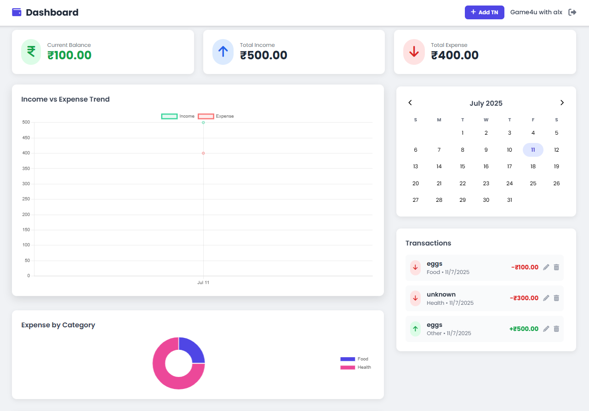

# 💸 Budget Tracker

**Track your income, expenses, and financial goals with clarity and control.**

A sleek and intuitive dashboard designed for smarter budgeting. Visualize your spending patterns, stay on top of your financial goals, and gain real-time insights—all in one place.

---

<p align="center">
  <a href="https://free-budget-tracker.netlify.app/">
  
  </a>
</p>

---

## 🚀 Features

* 📊 **Live Dashboard** — Get real-time feedback on your finances
* 🗂️ **Categorized Transactions** — Organize income and expenses effortlessly
* 📆 **Monthly Calendar View** — See how your money flows over time
* 🎯 **Goal Setting** — Set spending or saving goals with progress tracking
* 🌗 **Dark Mode** — Budget day or night
* 💾 **Local Storage** — Your data stays private, saved right in your browser

---

## 📺 Live Preview

🔗 [Try it Live](https://free-budget-tracker.netlify.app/)

---

## 💻 Getting Started

1. Clone the repository:

   ```bash
   git clone https://github.com/your-username/Budget-Tracker.git
   cd Budget-Tracker
   ```

2. Open `index.html` in your browser to start budgeting.

---

## ☕ Support the Developer

<p align="center">
  <a href="https://www.buymeacoffee.com/rahul.sharma.alx" target="_blank">
    
  </a>
</p>

---

## 🔧 Built With

* HTML5
* Tailwind CSS
* Vanilla JavaScript
* ❤️ Passion for clean design

---

## 📜 License

This project is licensed under the MIT License.

---

> Crafted with clarity by [Your Name](https://github.com/your-username)
